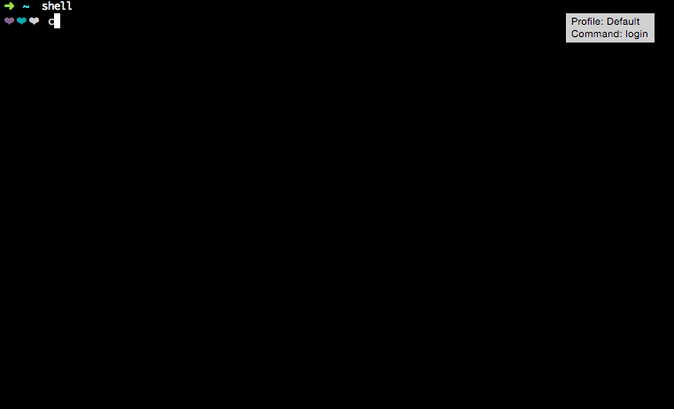

# Mini-Shell

A toy Unix Shell with job control.

## Demo



## Features

### Builtin Commands

`exit`: Quits the shell.

`jobs`: Lists all running or suspended background jobs.

`kill`: Sends signals to processes.

Arguments: [-signal] [PID]

`kill` must always be accompanied by signal flag and PID of the target process.

Signals:

- 9 or KILL [SIGKILL]
- 18 or STOP [SIGTSTP]
- 19 or CONT [SIGCONT]
- 2 or INT [SIGINT]

Eg:

```shell
$ kill -9 12346
or
$ kill -KILL 12346
```

### Foreground Process

Foreground process can be terminated by sending a `SIGINT` signal with `Ctrl-c` and suspended by sending `SIGTSTP` with `Ctrl-z`.

## Development

Developed and tested on go version go1.4.2 darwin/amd64.

## License

MIT
